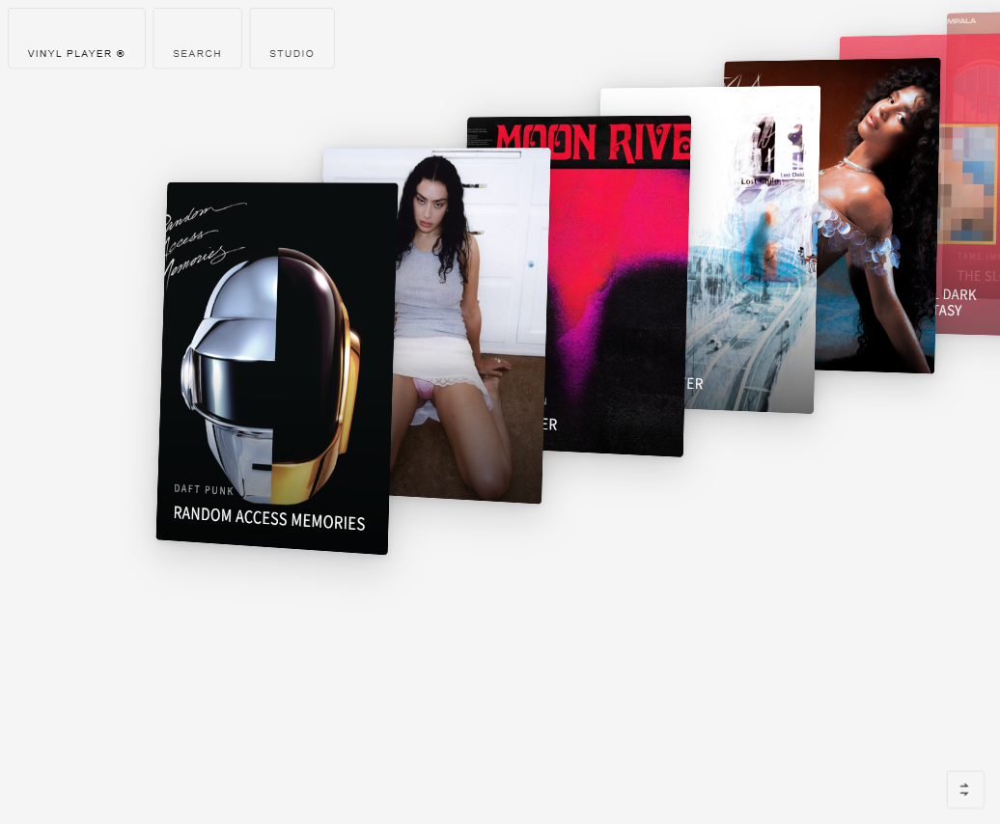
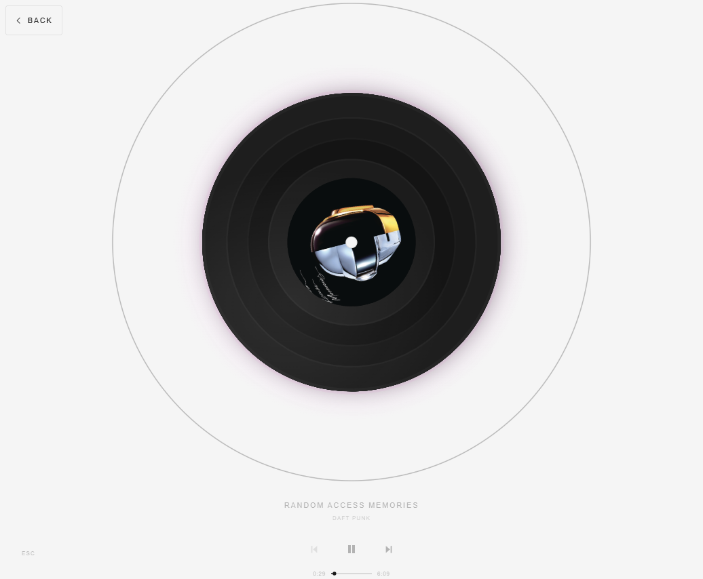
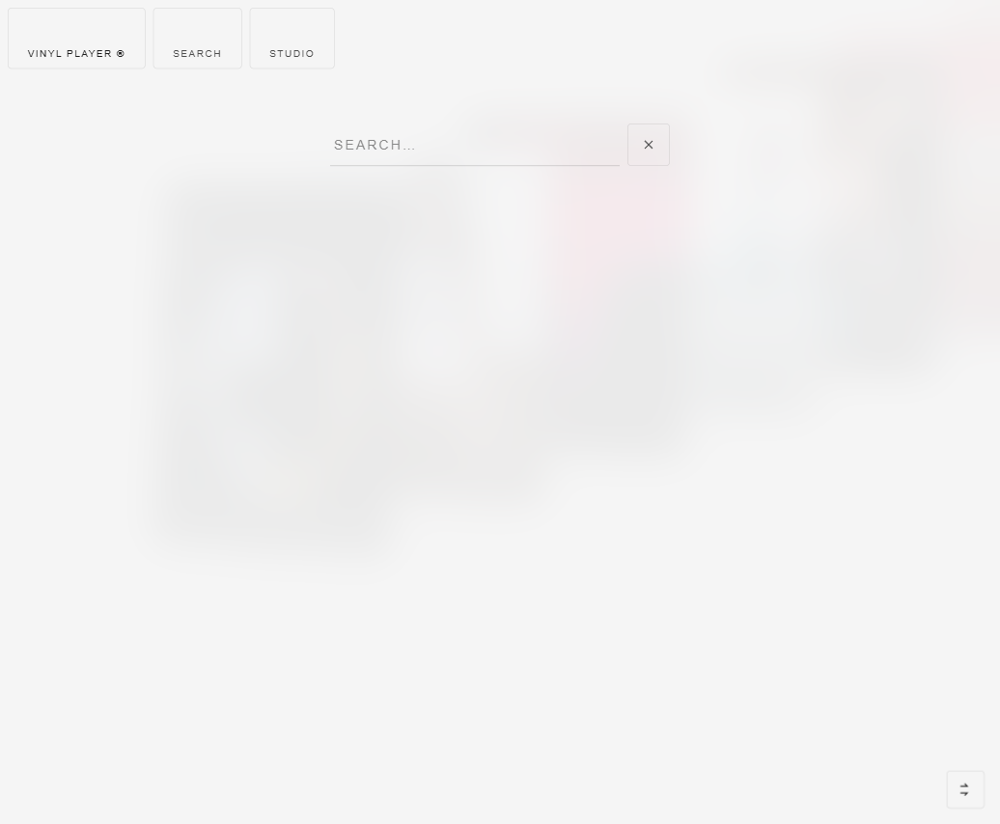

# IAMMUSIC

A vinyl record-themed web music player. 60 records are arranged in a 3D perspective gallery — click any one to play. The spin speed and ripple effects adapt to each song's BPM.



## What it looks like

**Gallery** — Records fan out like a deck of cards in perspective. Scroll to browse, each with its own album cover.



**Player** — Click a record to enter the player view. The album cover sits inside a spinning vinyl disc, with beat-synced ripple rings radiating outward.



**Search** — Hit SEARCH in the top-left to search for any song on NetEase Cloud Music and stream it instantly.

## Features

- **3D record gallery** — Perspective fan layout with depth changes on scroll
- **Live streaming** — No downloads needed, streams directly from NetEase Cloud Music
- **BPM-driven** — Record spin speed and ripple frequency match the song's tempo
- **Search** — Built-in search bar, powered by NetEase
- **Playback modes** — Sequential / Shuffle / Loop, toggle from the bottom-right button
- **Prev / Next** — Arrow keys or on-screen buttons
- **Studio page** — Contact info showcase

## Tech stack

| Layer | What's used |
|---|---|
| Frontend | React + TypeScript + Tailwind CSS |
| Backend | FastAPI (Python) |
| Music source | NetEase Cloud Music (via musicdl) |
| Animation | requestAnimationFrame + CSS |
| Audio analysis | Web Audio API (beat detection) |

## Getting started

### Prerequisites

- Node.js 18+
- Python 3.10+
- pip

### 1. Start the backend

```bash
cd backend
pip install -r requirements.txt
python main.py
```

Backend runs on `http://localhost:8000`.

### 2. Start the frontend

```bash
pnpm install
pnpm dev
```

Frontend runs on `http://localhost:5173`.

Open your browser and go to `http://localhost:5173`.

## Project structure

```
vinyl-player/
├── src/
│   ├── App.tsx              # Main routing & state
│   ├── components/
│   │   ├── AlbumGrid.tsx    # 3D record gallery
│   │   ├── AlbumCard.tsx    # Single record card
│   │   ├── PlayerView.tsx   # Player view
│   │   ├── VinylDisc.tsx    # Spinning vinyl animation
│   │   ├── SoundRipples.tsx # Beat-synced ripple rings
│   │   ├── PlaybackControls.tsx  # Playback controls
│   │   ├── PlaybackMode.tsx     # Mode toggle
│   │   ├── SearchBar.tsx    # Search
│   │   ├── NavHeader.tsx    # Top navigation
│   │   └── StudioPage.tsx   # Contact info page
│   ├── data/
│   │   └── albums.ts        # 60 record entries
│   └── hooks/
│       └── useAudioPlayer.ts # Audio playback logic
├── backend/
│   ├── main.py              # FastAPI server
│   └── musicdl_service.py   # NetEase search & stream proxy
└── public/
    └── covers/              # Local album covers
```

## Author

**Tyler** — [GitHub](https://github.com/Tyleraltight) · [Email](mailto:chuzihang456@gmail.com)
